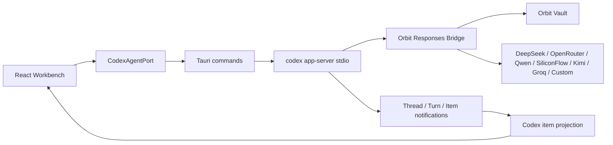

# Orbit Code Architecture

当前架构以 Codex sidecar 为唯一 Agent runtime。Orbit 不再在前端实现模型工具循环。

## Runtime Boundary

## Frontend

- `src/state/useWorkspace.ts` is a workbench facade.
- `src/state/useCodexSession.ts` owns Codex thread and turn lifecycle.
- `src/runtime/codexAgentPort.ts` is the only frontend command port for sidecar operations.
- `src/runtime/codexItemProjection.ts` converts Codex items into thread, review, terminal, action, and run-step view models.
- UI surfaces keep their current shell but consume Codex-backed projections.

## Rust

- `src-tauri/src/commands/codex.rs` owns the current Codex app-server integration: sidecar process launch, temporary config generation, JSON-RPC request/response routing, app-server request handling, notification mapping, and the loopback Responses bridge.
- `codex_turn_start` returns a running turn quickly; the blocking app-server run continues on a background thread and emits `codex://status`, `codex://item`, `codex://turn`, and `codex://error`.
- The next hardening step is persistent app-server reuse with durable `Orbit threadId -> Codex threadId` mapping. Do not document that as complete until the real long-turn path has live smoke evidence.
- The provider bridge must bind only to loopback and must read secrets from vault memory.
- Generated Codex config must point to `orbit-bridge` and contain no API keys.
- Codex sidecar packaging uses a preparation script plus version/checksum pin. Large sidecar binaries are not committed.

## Storage

- New session schema is `codex-sidecar.v1`.
- Old sessions are not imported into the runtime.
- Old sessions may be displayed as unsupported and deleted.

## Provider Model

The provider registry remains metadata-only: labels, model discovery, capability flags, and vault key mapping. Build entry must be blocked for models that cannot reliably run through the Responses bridge.

DeepSeek is the only Build provider in the current mainline. OpenRouter, Qwen/DashScope, SiliconFlow, Kimi, Groq, and custom OpenAI-compatible providers may be discovered but remain blocked until each adapter has live bridge evidence.
